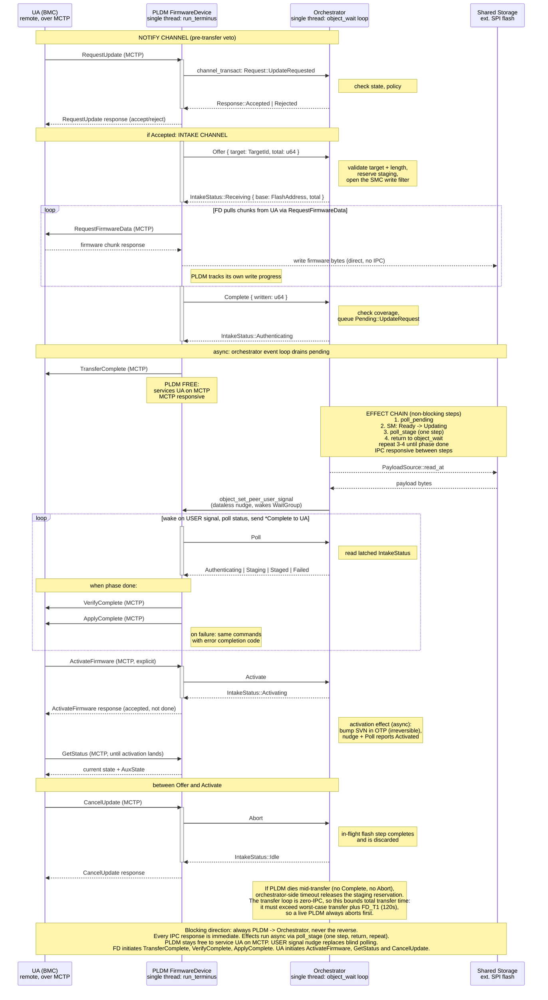

# PLDM/Orchestrator IPC

How the PLDM FirmwareDevice service and the orchestrator communicate during a
firmware update. Two Pigweed kernel channels, both initiated by PLDM: a notify
channel for pre-transfer veto, and an intake channel for control messages
(Offer, Complete, Poll, Activate, Abort) and the async effect chain. Firmware
bytes go direct to flash, never through IPC.

Design decisions:

- Activate is on the wire (ActivateFirmware from the UA), not implicit after
  staging.
- Flash seam is async: poll_stage calls start_erase/start_program, returns,
  checks is_busy on the next call and then complete_op, which is where the
  operation's error surfaces. Uses FlashDriver's split API, not BlockingFlash.
- USER signal is level-triggered (verified from Pigweed kernel source): OR'd
  into the peer's active_signals bitfield, persists until lowered. No lost
  wakeups.
- MCTP server (separate process) buffers 4 messages while PLDM is in a
  transact. Overflow drops silently, no backpressure to the bus. Recovery from
  a dropped message is PLDM's, not this seam's: pldm-lib defaults FD_T1 (update
  mode idle) to 120s and FD_T2 (RequestFirmwareData retry) to 5s.
- A Rejected veto becomes an error completion code in the RequestUpdate
  response, ALREADY_IN_UPDATE_MODE when the reason is an update already
  running; the UA retries.
- Receiving carries the staging base address, not just the total. The
  orchestrator picks the region and programs the SMC write filter for it, so
  the window PLDM writes through and the window the hardware allows come from
  one place. PLDM holds no board layout.
- Write access is two layers: a typed StagingWindow inside PLDM (Rust, catches
  offset bugs) backed by an SMC write filter PLDM cannot reprogram (catches a
  compromised process). The orchestrator opens the filter on Offer and closes
  it on Complete/Abort/timeout. How the filter registers are kept out of
  PLDM's reach (separate MPU region, separate controller/CS, lock-until-reset)
  depends on the AST10x0 register layout; see "Who owns the SPI flash
  controller" in open questions.
- Transfer loop is zero-IPC: PLDM writes firmware bytes direct to flash and
  tracks progress locally. Complete carries the byte count for the
  orchestrator's coverage check (early-fail only, verify hashes the staged
  image anyway). On a write error PLDM sends Abort to release staging and
  reports the failure to the UA in TransferComplete's result code.

## Write-access containment

PLDM writes firmware bytes direct to flash (zero-IPC, see above), so write
access must be confined to the inactive slot and only for the duration of the
transfer. Two layers, each catching a different class of failure:

The first layer is a typed StagingWindow inside the PLDM process. When PLDM
receives a Receiving response it constructs the window from the base and total
it carries: a bounded handle over the staging region, capped to its length. All writes go
through the window; it translates offsets and rejects anything outside the
region. The window is dropped on Complete, Abort, or timeout, so PLDM holds
no flash handle outside an active transfer. This catches offset bugs and
use-after-transfer bugs but not a compromised process, because PLDM still has
the underlying flash mapped.

The second layer is a hardware write filter that PLDM cannot reprogram. The SMC
raises SmcInterrupt::WriteProtected on writes outside an allowed region. The
orchestrator (or a dedicated flash-service process) opens the filter for the
staging region on Offer and closes it on Complete/Abort/timeout. PLDM needs the
SMC control registers that drive erase/program commands, but must not be able
to touch the filter/write-protect registers. Whether those register sets are
separable (distinct MPU pages, separate controller/CS, or lock-until-reset
bits) depends on the AST10x0 register layout and is folded into the "who owns
the SPI flash controller" open question below.

The net effect: bugs hit the Rust window check, a compromised process hits the
hardware filter, and both "inactive slot only" and "only during an update" are
enforced. Even a fully rogue PLDM can at worst corrupt the staging area and
fail verify; the active image is never written by PLDM at any point in the
flow, and activation is orchestrator-side metadata plus the SVN bump in OTP.

## Open questions

Who owns the SPI flash controller. The diagram has PLDM writing the staging
region and the orchestrator reading it, but FlashDriver takes `&mut self` and
says nothing about multiple clients. Either each process drives its own
controller over disjoint regions, or one process owns the driver and the other
reaches it over IPC. Sequencing keeps the two off the same bytes at the same
time (the orchestrator reads only after Complete), so this is about the driver
and the controller, not about the protocol. A related constraint from the
write-access containment section: PLDM needs the erase/program control
registers but must not reach the write-protect/filter registers. Whether those
register sets fall on separate MPU pages on the AST10x0 (datasheet needed)
determines whether pw_kernel can enforce the split, or whether a dedicated
flash-service process must own the entire SMC and proxy writes.

How the orchestrator learns that PLDM died, short of the timeout. Abort is a
message a live PLDM sends; the timeout covers the case where it can send
nothing. pw_kernel has no peer-closed signal: the set is READABLE, WRITEABLE,
ERROR, JOINABLE, USER and the interrupt bits. The one existing path is
ChannelInitiatorObject::reset, which raises ERROR on the handler, and only if a
transaction was in flight and only once someone joins the dead process. During
the zero-IPC transfer loop no transaction is in flight, so the orchestrator
sees nothing. Replacing the timeout means the orchestrator waits on JOINABLE on
PLDM's process object, or the supervisor that joins PLDM tells it. That is a
supervisor question, not a channel one.

The ActivateFirmware response says accepted, so the UA learns the outcome of
the irreversible SVN bump only from GetStatus. If activation fails after the
response, there is no rollback: the doc needs a line on what the UA is expected
to do.
