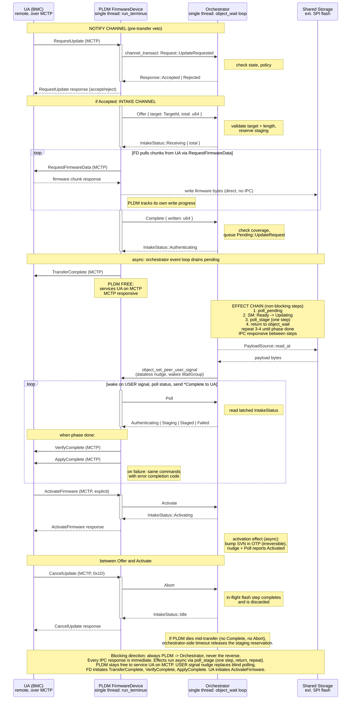

# PLDM/Orchestrator IPC

How the PLDM FirmwareDevice service and the orchestrator communicate during a
firmware update. Two Pigweed kernel channels, both initiated by PLDM: a notify
channel for pre-transfer veto, and an intake channel for control messages
(Offer, Complete, Poll, Activate, Abort) and the async effect chain. Firmware
bytes go direct to flash, never through IPC.

Design decisions:

- Activate is on the wire (ActivateFirmware from the UA), not implicit after
  staging.
- Flash seam is async: poll_stage calls start_erase/start_program, returns,
  checks is_busy on the next call. Uses FlashDriver's split API, not
  BlockingFlash.
- USER signal is level-triggered (verified from Pigweed kernel source): OR'd
  into the peer's active_signals bitfield, persists until lowered. No lost
  wakeups.
- MCTP server (separate process) buffers 4 messages while PLDM is in a
  transact. Overflow drops silently, no backpressure to the bus.
- Transfer loop is zero-IPC: PLDM writes firmware bytes direct to flash and
  tracks progress locally. Complete carries the byte count for the
  orchestrator's coverage check (early-fail only, verify hashes the staged
  image anyway). On a write error PLDM can nudge and report Failed via Poll,
  no extra IPC verb needed.

